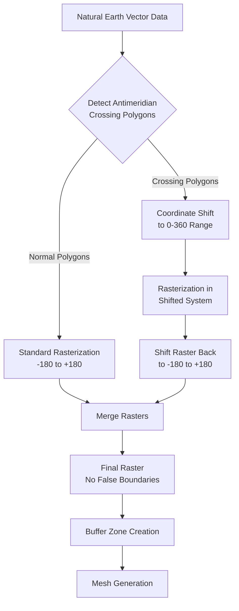

# Antimeridian (International Date Line) Issue - Solution Plan

## Problem Statement

When converting Natural Earth coastline vector data to raster format for global mesh generation, polygons that cross the International Date Line (IDL/antimeridian at ±180°) are being split into two separate polygons by the source data. During rasterization, only one side (left side, near -180°) shows a false boundary line, while the right side (near +180°) correctly represents the actual coastline.

### Visual Problem
- **Left Side (near -180°)**: Shows unwanted/false boundary line
- **Right Side (near +180°)**: Shows correct coastline (desired result)
- **Root Cause**: Split polygons are being rasterized independently, creating artificial boundaries

## Current Workflow Analysis

### Data Flow
```
Natural Earth Coastline (vector)
    ↓
create_land_ocean_vector_mask_naturalearth()
    ↓
Vector file with split polygons at antimeridian
    ↓
convert_vector_to_global_raster()
    ↓
rasterize_vector()
    ↓
Raster with false boundary at -180°
    ↓
fix_raster_antimeridian_issue()  (post-processing fix)
    ↓
Final raster (attempted fix)
```

### Current Fix Limitations
The existing `fix_raster_antimeridian_issue()` function is a post-processing raster-based fix, which may not fully address the underlying vector geometry problem.

## Root Cause Analysis

### Why Split Polygons Create False Boundaries

1. **Natural Earth Data Format**: Polygons crossing the antimeridian are pre-split into two polygons:
   - Polygon A: Eastern edge near +180°
   - Polygon B: Western edge near -180°

2. **Rasterization Behavior**: When GDAL rasterizes these polygons:
   - Each polygon is treated independently
   - Polygon edges at -180° and +180° are both rasterized
   - Creates artificial "closing" boundaries that don't exist in reality

3. **The False Boundary**: The edge near -180° appears as a false coastline because:
   - It's the western edge of a polygon that should connect to the eastern edge near +180°
   - The rasterizer doesn't understand these are parts of the same feature
   - ALL_TOUCHED option makes any pixel touching the polygon edge get burned

## Solution Architecture

### Strategy: Vector-Level Preprocessing

Instead of fixing the raster after the fact, we need to handle antimeridian-crossing polygons **before** rasterization.

### Approach Options

#### Option 1: Coordinate Shifting (Recommended)
**Shift problematic polygons to avoid the antimeridian**

```
For each polygon pair crossing antimeridian:
1. Detect: polygon has coordinates near both -180° and +180°
2. Shift: Move coordinates to 0-360° range temporarily
3. Rasterize: Convert to raster in shifted coordinate space
4. Unwrap: Shift raster back to -180 to +180° range
```

**Pros:**
- Preserves polygon integrity
- Clean rasterization without false boundaries
- Works with existing GDAL functions

**Cons:**
- Requires coordinate transformation
- Need to handle edge cases at shifted boundaries

#### Option 2: Polygon Unwrapping
**Merge split polygons before rasterization**

```
For each polygon crossing antimeridian:
1. Detect: Find polygon pairs near ±180°
2. Merge: Combine split polygons using coordinate transformation
3. Represent: Use 0-360° coordinate system or multipolygon with proper topology
4. Rasterize: Convert merged polygon
```

**Pros:**
- Mathematically correct representation
- Single merged polygon

**Cons:**
- Complex polygon matching logic
- Risk of incorrectly merging unrelated polygons
- More implementation complexity

#### Option 3: Dual Rasterization
**Rasterize in two coordinate systems and merge**

```
1. Rasterize in -180 to +180° (standard)
2. Rasterize in 0 to 360° (shifted)
3. Merge results intelligently at antimeridian
```

**Pros:**
- Comprehensive coverage
- Can validate both results

**Cons:**
- Double computation time
- Complex merging logic
- Potential for artifacts at merge seam

### Recommended Solution: Hybrid Approach

**Phase 1: Vector Detection and Classification**
- Identify polygons crossing the antimeridian
- Classify features as "antimeridian-crossing" vs "normal"

**Phase 2: Coordinate System Shifting**
- For antimeridian-crossing polygons:
  - Shift to 0-360° longitude range
  - Rasterize separately
  - Shift result back to -180 to +180°

**Phase 3: Raster Merging**
- Combine normal rasterization with shifted rasterization
- Handle overlap regions carefully

## Implementation Plan

### New Functions to Create

#### 1. `detect_antimeridian_crossing_polygons()`
```python
def detect_antimeridian_crossing_polygons(
    sFilename_vector_in: str,
    dThreshold_longitude: float = 170.0
) -> tuple[list, list]:
    """
    Identify polygons that cross the antimeridian.

    Returns:
        - List of FIDs for antimeridian-crossing features
        - List of FIDs for normal features
    """
```

**Detection Logic:**
- Check if polygon has coordinates with longitude > 170° AND < -170°
- If true, mark as antimeridian-crossing
- Consider small islands vs large landmasses

#### 2. `shift_vector_coordinates()`
```python
def shift_vector_coordinates(
    sFilename_vector_in: str,
    sFilename_vector_out: str,
    dLongitude_shift: float = 180.0,
    aFID_list: list = None
) -> None:
    """
    Shift specified features to 0-360° longitude range.

    Parameters:
        - sFilename_vector_in: Input vector file
        - sFilename_vector_out: Output shifted vector file
        - dLongitude_shift: Amount to shift (default 180°)
        - aFID_list: List of feature IDs to shift (None = all)
    """
```

**Transformation:**
- For each feature in aFID_list:
  - Read geometry
  - For each coordinate: if lon < 0: lon = lon + 360
  - Write modified geometry

#### 3. `rasterize_vector_with_antimeridian_handling()`
```python
def rasterize_vector_with_antimeridian_handling(
    sFilename_vector_in: str,
    sFilename_raster_out: str,
    dResolution_x: float,
    dResolution_y: float,
    **kwargs
) -> None:
    """
    Enhanced rasterization with automatic antimeridian handling.

    Process:
        1. Detect antimeridian-crossing polygons
        2. Split into two groups
        3. Rasterize normal polygons standard way
        4. Shift and rasterize crossing polygons
        5. Merge results
    """
```

### Modified Functions

#### Update `convert_vector_to_global_raster()`
Add parameter:
```python
iFlag_fix_antimeridian_in: int = 1
```

If enabled:
- Call new antimeridian handling function
- Otherwise use existing logic

### Workflow Integration

Update the workflow in `run_workflow_pyflowline_mesh_only.py`:

```python
# Current (line 216-219):
sFilename_tif_wo_island, sFilename_vector_coastline = create_land_ocean_mask_from_naturalearth(
    sWorkspace_coastline_output,
    dResolution_x_in, dResolution_y_in,
    dThreshold_area_island,
    dResolution_coastline_buffer)

# Enhanced version:
sFilename_tif_wo_island, sFilename_vector_coastline = create_land_ocean_mask_from_naturalearth(
    sWorkspace_coastline_output,
    dResolution_x_in, dResolution_y_in,
    dThreshold_area_island,
    dResolution_coastline_buffer,
    iFlag_fix_antimeridian=1)  # NEW PARAMETER
```

## Implementation Details

### Detection Algorithm

```python
def is_antimeridian_crossing(geometry, threshold=170.0):
    """
    Check if a geometry crosses the antimeridian.

    Logic:
    - Extract all X coordinates (longitudes)
    - Check for coords with X > threshold AND X < -threshold
    - If both exist, polygon crosses antimeridian
    """
    coords = extract_all_coordinates(geometry)
    lons = [c[0] for c in coords]

    has_east = any(lon > threshold for lon in lons)
    has_west = any(lon < -threshold for lon in lons)

    return has_east and has_west
```

### Coordinate Shifting

```python
def shift_longitude_to_360(lon):
    """Shift longitude from [-180, 180] to [0, 360] range"""
    if lon < 0:
        return lon + 360
    return lon

def shift_longitude_to_180(lon):
    """Shift longitude from [0, 360] to [-180, 180] range"""
    if lon > 180:
        return lon - 360
    return lon
```

### Raster Merging Strategy

When merging rasters from different coordinate systems:

```python
# Region 1: -180 to -170 (use shifted raster)
# Region 2: -170 to +170 (use normal raster)
# Region 3: +170 to +180 (use shifted raster)

# Pseudo-code:
final_raster = np.zeros((nrows, ncols))
final_raster[:, 0:10] = shifted_raster[:, -10:]  # left edge from shifted
final_raster[:, 10:-10] = normal_raster[:, 10:-10]  # middle from normal
final_raster[:, -10:] = shifted_raster[:, 0:10]  # right edge from shifted
```

## Testing Strategy

### Test Cases

1. **Simple Antimeridian Crossing**
   - Create test polygon crossing at 180°
   - Verify no false boundaries

2. **Multiple Crossings**
   - Russia/Alaska region
   - Fiji/Tonga region
   - Verify all handled correctly

3. **Edge Cases**
   - Polygon exactly at 180°
   - Polygon at -180°
   - Very small islands near dateline

4. **Performance**
   - Global dataset at various resolutions
   - Measure processing time impact

### Validation

```python
# Visual inspection criteria:
- No vertical line at ±180° longitude
- Continuous coastlines across dateline
- No gaps or artifacts
- Matches reference data (if available)
```

## Performance Considerations

### Computational Cost

**Additional Operations:**
- Detection: O(n) where n = number of features
- Coordinate shifting: O(m) where m = number of coordinates
- Dual rasterization: 2x rasterization time for crossing features

**Estimated Overhead:**
- ~10-20% for typical global datasets
- Higher (~50%) if many features cross antimeridian

### Optimization Strategies

1. **Spatial Indexing**: Pre-filter features by bounding box
2. **Caching**: Cache detection results for repeated use
3. **Parallel Processing**: Process normal and shifted rasters in parallel
4. **Lazy Evaluation**: Only detect/shift if necessary

## File Structure

### New Files to Create

```
pyearth/toolbox/geometry/
    └── antimeridian.py              # New module
        ├── detect_antimeridian_crossing_polygons()
        ├── shift_vector_coordinates()
        ├── unwrap_antimeridian_polygon()
        └── merge_split_polygons()

pyearth/toolbox/conversion/
    └── rasterize_vector_antimeridian.py    # New module
        ├── rasterize_vector_with_antimeridian_handling()
        ├── merge_shifted_rasters()
        └── validate_antimeridian_fix()
```

### Modified Files

```
pyearth/toolbox/conversion/convert_vector_to_global_raster.py
    - Add iFlag_fix_antimeridian_in parameter
    - Call new antimeridian handling functions

hexwatershed_utility/preprocess/features/coastline/create_land_ocean_mask_from_naturalearth.py
    - Add iFlag_fix_antimeridian parameter
    - Pass through to rasterization functions
```

## Mermaid Workflow Diagram



## Alternative: Pure Vector Solution

If raster merging proves complex, consider pure vector preprocessing:


This approach:
- Converts ALL data to 0-360° before rasterization
- Rasterizes in continuous space
- Converts raster back to -180/+180°
- Simpler logic, but requires full coordinate transformation

## Recommended Next Steps

1. **Prototype Detection Function**
   - Implement polygon crossing detection
   - Test on Natural Earth data
   - Identify all problematic features

2. **Implement Coordinate Shifting**
   - Create vector shifting function
   - Validate coordinate transformations
   - Test on sample data

3. **Develop Rasterization Logic**
   - Implement dual rasterization
   - Create raster merging function
   - Test on small region first

4. **Integration Testing**
   - Test full workflow end-to-end
   - Validate output visually
   - Compare with original results

5. **Performance Optimization**
   - Profile execution time
   - Optimize bottlenecks
   - Add progress reporting

6. **Documentation**
   - Document new functions
   - Update workflow documentation
   - Create usage examples

## Success Criteria

- ✓ No false boundary lines at ±180° longitude
- ✓ Continuous coastlines across antimeridian
- ✓ All Natural Earth polygons properly handled
- ✓ Performance overhead < 30%
- ✓ Visual validation passes
- ✓ Integration with existing workflow seamless
- ✓ Comprehensive test coverage

## References

- GDAL/OGR Coordinate Transformation: https://gdal.org/api/ogr_geometry.html
- Natural Earth Data Issues with Antimeridian: https://github.com/nvkelso/natural-earth-vector/issues
- Shapely Antimeridian Handling: https://shapely.readthedocs.io/
- PROJ Coordinate Transformations: https://proj.org/

## Notes

- The antimeridian issue is a well-known problem in global GIS
- Multiple libraries (Shapely, GeoPandas) have utilities for this
- Consider using existing libraries if they meet needs
- Custom solution gives more control for specific use case
